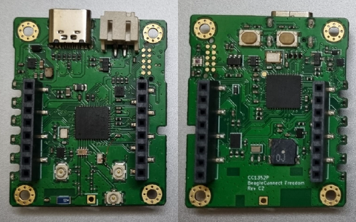

.. _beagleconnect_freedom:

BeagleConnect Freedom
#####################

Overview
********

BeagleBoard.org BeagleConnect Freedom is a wireless
Internet of Things board based on the SimpleLink multi-Standard CC1352P wireless MCU.

   BeagleBoard.org BeagleConnect Freedom

Hardware
********
BeagleBoard.org BeagleConnect Freedom board features the CC1352P wireless microcontroller.
The BeagleConnect Freedom is the first available BeagleConnect solution consisting
of a board and a case which ships programmed and ready to be used.

BeagleConnect Freedom board runs the Zephyr RTOS and has mikroBUS ports along 
with BLE and Sub-GHz radios on it.

The CC1352P wireless MCU has a 48 MHz Arm Cortex-M4F SoC and a Bluetooth Low Energy and IEEE 802.15.4.

Supported Features
==================

The CC1352P LaunchPad board configuration supports the following hardware
features:

+-----------+------------+----------------------+
| Interface | Controller | Driver/Component     |
+===========+============+======================+
| GPIO      | on-chip    | gpio                 |
+-----------+------------+----------------------+
| PINMUX    | on-chip    | pinmux               |
+-----------+------------+----------------------+
| UART      | on-chip    | serial               |
+-----------+------------+----------------------+
| I2C       | on-chip    | i2c                  |
+-----------+------------+----------------------+
| SPI       | on-chip    | spi                  |
+-----------+------------+----------------------+

Other hardware features are not supported by the Zephyr kernel.

Connections and IOs
===================

+-------+-----------+---------------------+
| Pin   | Function  | Usage               |
+=======+===========+=====================+
| DIO5  | RST_MB2   | RESET PIN           |
+-------+-----------+---------------------+
| DIO6  | RST_MB1   | RESET PIN           |
+-------+-----------+---------------------+
| DIO7  | INT_SENSOR| INTERRUPT PIN       |
+-------+-----------+---------------------+
| DIO8  | FLASH_CS  | Flash CS            |
+-------+-----------+---------------------+
| DIO9  | MOSI      | SPI MOSI            |
+-------+-----------+---------------------+
| DIO10 | SCK       | SPI CLK             |
+-------+-----------+---------------------+
| DIO11 | MISO      | SPI MISO            |
+-------+-----------+---------------------+
| DIO12 |           | UART RXD            |
+-------+-----------+---------------------+
| DIO13 |           | UART TXD            |
+-------+-----------+---------------------+
| DIO14 | 900M      | D5 LED              |
+-------+-----------+---------------------+
| DIO15 | USER_BOOT | BOOT BUTTON         |
+-------+-----------+---------------------+
| DIO16 |CC1352_TDO | JTAG TDO            |
+-------+-----------+---------------------+
| DIO17 |CC1352_TDI | JTAG TDI            |
+-------+-----------+---------------------+
| DIO18 | 2.4G      | D6 LED              |
+-------+-----------+---------------------+
| DIO19 | PWM_MB2   | PWM PIN             |
+-------+-----------+---------------------+
| DIO20 | INT_MB2   | INTERRUPT PIN       |
+-------+-----------+---------------------+
| DIO21 |TX_MB2_RX  | UART RXD            |
+-------+-----------+---------------------+
| DIO22 | RX_MB2_TX |  UART TXD           |
+-------+-----------+---------------------+
| DIO23 | AN_MB1    | ANALOG PIN          |
+-------+-----------+---------------------+
| DIO24 | AN_MB2    | ANALOG PIN          |
+-------+-----------+---------------------+
| DIO25 | SCL       | I2C SCL             |
+-------+-----------+---------------------+
| DIO26 | SDA       | I2C SDA             |
+-------+-----------+---------------------+
| DIO27 | CS_MB2    | SPI CS              |
+-------+-----------+---------------------+
| DIO28 | CS_MB1    | SPI CS              |
+-------+-----------+---------------------+
| DIO29 | INT_MB1   | INTERRUPT PIN       |
+-------+-----------+---------------------+
| DIO30 | PWM_MB1   | PWM PIN             |
+-------+-----------+---------------------+

References
*********

BeagleBoard.org BeagleConnect Freedom reference repository:
  https://beagleconnect.org
